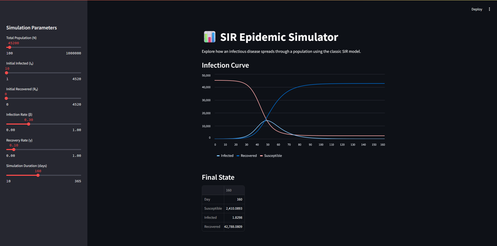

# 📊 SIR Epidemic Simulator

A simple interactive Streamlit app that visualizes how infectious diseases spread using the classic SIR (Susceptible-Infected-Recovered) model.

## 🚀 Features

- Adjustable population size, infection and recovery rates
- Dynamic infection curves over time
- Clean, interactive interface using Streamlit
- Real-time plot updates

## 📸 Preview



## ⚙️ How to Run

1. Clone the repository:

```bash
git clone https://github.com/yourusername/sir-epidemic-simulator.git
cd sir-epidemic-simulator
```

2. Install dependencies (create a virtual environment if you prefer):

```bash
pip install -r requirements.txt
```

3. Run the App

```bash
streamlit run SIR.py
```

4. Visit the local URL provided (usually http://localhost:8501).

## 📦 Requirements

The main packages used:

  - numpy

  - pandas

  - matplotlib

  - streamlit

## 📖 About the SIR Model

The SIR model is a fundamental model in epidemiology that divides the population into three compartments:

    S: Susceptible individuals

    I: Infected individuals

    R: Recovered (or removed) individuals

The system evolves over time based on infection and recovery rates.
