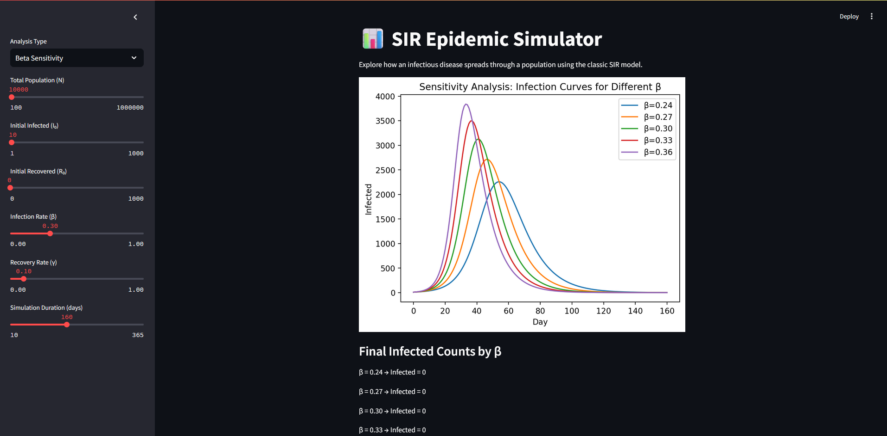
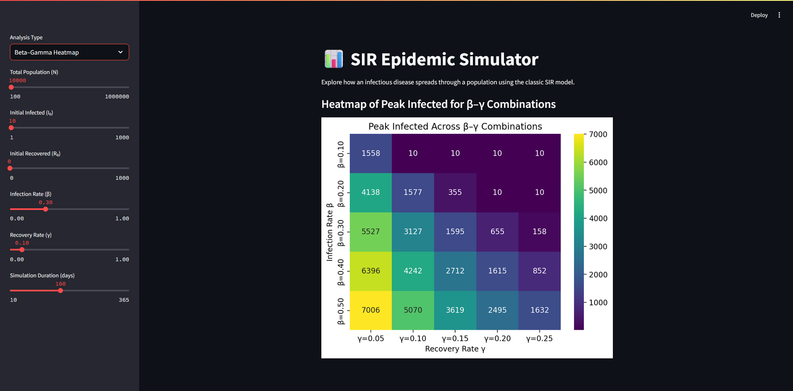

# 📊 SIR Epidemic Simulator

An interactive Streamlit app that models how infectious diseases spread through a population using the classic SIR (Susceptible–Infected–Recovered) model.

Built with Python, this app allows users to simulate and visualize epidemic dynamics, perform parameter sensitivity analysis, and explore how infection and recovery rates shape the course of an outbreak.

## 🚀 Features

- Adjustable parameters: population size, infection rate (β), recovery rate (γ), and duration
- Single simulation mode with infection curve over time
- Beta (β) sensitivity analysis: visualize how varying β affects infection dynamics
- Beta–Gamma heatmap: explore peak infection levels across multiple β–γ combinations
- Clean, real-time visualizations with Matplotlib and Seaborn
- Interface built entirely with Streamlit

## 📸 Preview





## 🧪 Analysis Modes

| Mode                   | Description                                               |
| ---------------------- | --------------------------------------------------------- |
| **Single Simulation**  | Simulates the infection curve using selected parameters   |
| **Beta Sensitivity**   | Plots multiple infection curves with varying β values     |
| **Beta–Gamma Heatmap** | Visualizes peak infection across β–γ grid using a heatmap |


## ⚙️ How to Run

1. Clone the repository:

```bash
git clone https://github.com/yourusername/sir-epidemic-simulator.git
cd sir-epidemic-simulator
```

2. Install dependencies (create a virtual environment if you prefer):

```bash
pip install -r requirements.txt
```

3. Run the App

```bash
streamlit run SIR.py
```

4. Visit the local URL provided (usually http://localhost:8501).

## 📦 Requirements

The main packages used:

  - numpy

  - pandas

  - matplotlib

  - seaborn

  - streamlit

## 📖 About the SIR Model

The SIR model is a foundational epidemiological model dividing a population into three groups:

    S: Susceptible, individuals who can catch the disease

    I: Infected, individuals currently infected

    R: Recovered (or removed), individuals who have recovered or been removed

The model uses differential equations to track transitions over time, governed by the infection rate (β) and recovery rate (γ).
